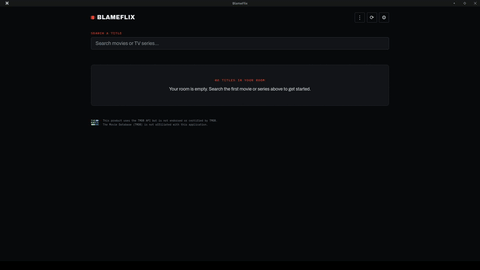
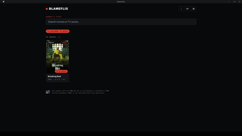
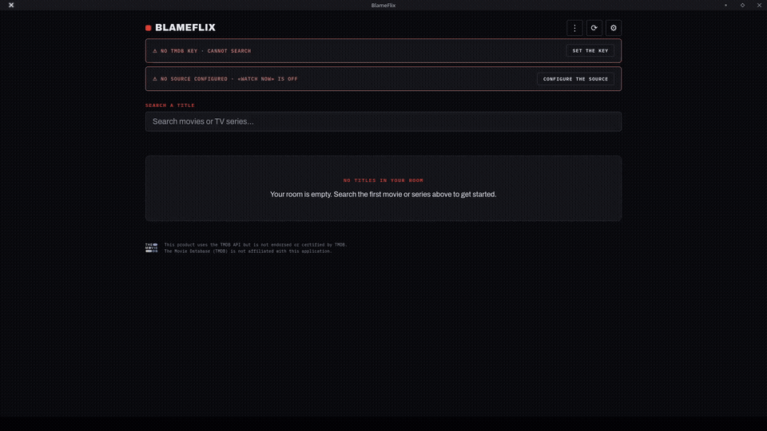

# BlameFlix

> **Lingua / Language**: **Italiano** (questo documento) | [English](README.md)

[](https://github.com/padelle2603/blameflix/releases/latest)

> ⬇ Scarica l'**APK (Android)**, l'**AppImage (Linux)** o l'**exe portatile (Windows)** dall'[ultima release](https://github.com/padelle2603/blameflix/releases/latest).

BlameFlix è il tuo **catalogo personale** per film e serie TV: un unico posto dove
cercare un titolo, salvarlo nella tua libreria, ricordare quali puntate hai visto
e quale stagione ti aspetta, e ricevere un avviso quando esce la prossima.

Non sostituisce le piattaforme di streaming: vive *sopra* di esse. Le piattaforme
restano ciò che sono — i luoghi dove si guarda — mentre BlameFlix diventa ciò che
a loro manca — il luogo dove si *ricorda*. L'idea è semplice: **tu scegli dove
guardare, BlameFlix ricorda tutto il resto.**

## Indice

- [Perché esiste](#perché-esiste)
- [Core features](#core-features)
- [Tutorial](#tutorial)
- [Piattaforme](#piattaforme)
- [Aggiornamenti](#aggiornamenti)
- [Sviluppo](#sviluppo)
- [Ringraziamenti](#ringraziamenti)

## Perché esiste

La visione oggi è frammentata: un titolo su una piattaforma, un altro su una
seconda, un terzo in televisione. Ogni servizio è un universo chiuso, con il
proprio catalogo, il proprio "visto / da vedere" e le proprie notifiche. Nessuna
piattaforma parla con le altre, e la memoria di ciò che guardiamo resta
confinata dentro ciascuna di esse. Perdi il filo: non ricordi dove hai lasciato
una serie, a che stagione sei, quando esce la puntata successiva.

BlameFlix nasce per riunire ciò che è disperso: uno strato personale e privato,
interamente sul tuo dispositivo, che ti restituisce un'immagine unica della tua
visione.

- **Manifesto** — la missione e i principi guida: privacy by design, neutralità,
  legalità e libertà dell'utente. Vedi [MANIFEST.md](Legal%20Notes/MANIFEST.md).
- **Legalità** — BlameFlix è uno strumento neutro, come un browser: non ospita,
  non fornisce e non suggerisce alcuna fonte di contenuti, non mantiene elenchi
  di siti e apre solo l'URL che digiti. Il blocco di magnet e torrent riguarda
  una categoria di protocollo, non singoli siti. Al primo avvio è obbligatorio
  accettare un disclaimer. Vedi [LEGAL.md](Legal%20Notes/LEGAL.md).
- **Privacy** — tutto è memorizzato sul tuo dispositivo e non c'è alcun server:
  nessun account, nessun cloud, nessun tracciamento. Le uniche richieste in uscita
  sono quelle che avvii tu (TMDB, GitHub per gli aggiornamenti, Google Fonts e
  l'URL della sorgente che configuri). Vedi [PRIVACY.md](Legal%20Notes/PRIVACY.md).

## Core features

Una rapida occhiata alle funzionalità core.

### Ricerca

Scrivi un titolo e BlameFlix lo cerca nell'API pubblica di The Movie Database
(TMDB). Ti basta inserire una chiave personale gratuita nelle Impostazioni.



> Demo a 1080p: [search.mp4](Videos/search.mp4)

### Tracciamento

Segna le puntate viste (compresse in intervalli per occupare poco spazio),
riprendi da dove eri rimasto e salva stagioni/episodi anche quando TMDB non li
elenca.



> Demo a 1080p: [track.mp4](Videos/track.mp4)

### Impostazioni e «Guarda ora»

Configura la tua chiave TMDB e la **sorgente** che vuoi aprire da ogni scheda:
un template URL, anche diverso per ogni titolo, con i segnaposto `{id}`,
`{type}`, `{season}`, `{episode}`. Sono accettati solo collegamenti
`http/https` (magnet/torrent vengono rifiutati); se la sorgente è vuota il
pulsante resta inattivo.



> Demo a 1080p: [settings.mp4](Videos/settings.mp4)

### Libreria, notifiche di rilascio e backup

- **Libreria**: salvi i titoli solo per identificativo; i dettagli vengono
  riscaricati da TMDB quando servono e tutto resta in `localStorage` sul
  dispositivo.
- **Notifiche di rilascio**: all'avvio, a intervalli e al ritorno in primo
  piano, l'app confronta lo stato TMDB dei tuoi titoli salvati e ti avvisa
  quando esce una puntata nuova — tutto locale, nessun server.
- **Backup**: esporta e ripristina tutto in un singolo file JSON.

## Tutorial

Una breve guida, senza termini tecnici, per usare BlameFlix.

### 1. Installa BlameFlix

- **Android**: scarica l'`.apk` dall'[ultima release](https://github.com/padelle2603/blameflix/releases/latest) e installalo.
- **Linux**: esegui l'`.AppImage`.
- **Windows**: esegui l'`.exe` portatile.
- **Web**: apri la versione online nel browser.
- Al primo avvio, leggi e accetta il breve disclaimer per continuare.

### 2. Collega un database di film gratuito (una tantum)

BlameFlix prende locandine e informazioni da un database pubblico gratuito chiamato TMDB.

1. Apri Impostazioni (icona a ingranaggio ⚙) → **API e Sorgenti**.
2. Nel sito TMDB, crea un account gratuito e copia la tua chiave personale (nelle impostazioni API del tuo account).
3. Incolla la chiave in BlameFlix e salva.
4. Fatto — la ricerca ora funziona. Se salti questo passaggio, l'app te lo ricorderà.

### 3. Cerca un titolo

Scrivi il nome di un film o di una serie nella barra di ricerca. I risultati compaiono con locandine e descrizioni nella lingua scelta. Tocca un risultato per aprirne i dettagli.

### 4. Salva i titoli e tieni traccia di ciò che guardi

- In ogni pagina di dettaglio, tocca **Salva** per aggiungere il titolo alla tua libreria.
- **Per le serie**: apri la serie e tocca le puntate che hai già visto. BlameFlix ricorda i tuoi progressi, anche per puntate non presenti nel database.
- **"Guarda ora"**: per una serie, questo pulsante salta alla prossima puntata non vista e la segna come vista non appena la apri.

### 5. Scegli dove si apre "Guarda ora"

BlameFlix apre una pagina web *che scegli tu* — non ne propone né suggerisce nessuna.

1. Impostazioni → **API e Sorgenti**.
2. Inserisci un link web per i film e/o le serie. Puoi usare piccoli segnaposto che BlameFlix compila in automatico:
   - `{id}` → l'ID del titolo
   - `{type}` → film o serie
   - `{season}` e `{episode}` → i numeri
   - Esempio: `https://tuo-sito.example/watch/{type}/{id}/{season}/{episode}`
3. Sono ammessi solo link web normali (`http`/`https`); i link magnet/torrent sono rifiutati. Se lo lasci vuoto, il pulsante resta disattivato.
4. **Link diverso per titolo**: nella pagina di un titolo puoi impostare un link personalizzato solo per quello.

### 6. Ricevi notifiche sulle nuove uscite

1. Impostazioni → **Notifiche** → attiva le notifiche.
2. Scegli se essere avvisato per **serie**, **film** o entrambi, e con quale frequenza l'app deve controllare.
3. BlameFlix verifica all'apertura dell'app, al ritorno in primo piano e secondo la tua cadenza — poi ti avvisa quando esce qualcosa di nuovo. Su Android puoi segnare una puntata come vista direttamente dalla notifica.

### 7. Usa la programmazione reale (serie)

Nella pagina di una serie, apri la sezione **Rete**: scegli il canale TV dall'elenco e incolla un link a una programmazione esterna. Così i promemoria seguono le date di messa in onda reali. Se il link non funziona, BlameFlix torna alle date del database.

### 8. Salva e ripristina i tuoi dati

- Impostazioni → **Dati** → **Esporta** salva l'intera libreria, la cronologia e le impostazioni in un unico file da conservare.
- **Importa** riporta tutto su qualsiasi dispositivo.
- Qui trovi anche **Elimina dati**, che cancella la libreria mantenendo chiave e lingua.

### 9. Cloud Sync (opzionale)

BlameFlix può sincronizzare i tuoi dati con un tuo progetto Supabase
personale. Lo sviluppatore non ospita né accede ai tuoi dati: porti il
tuo database. I dati vengono cifrati lato client con un token personale
(AES-GCM) prima della trasmissione, e la Row Level Security di Supabase
garantisce che ogni utente possa accedere solo alla propria partizione.

**Cosa viene sincronizzato:** watchlist, episodi visti, ultime riproduzioni,
selezioni personalizzate, cronologia novità, modalità visualizzazione,
filtro tipo, impostazioni notifiche, stato release e lingua.

**Cosa NON viene sincronizzata:** chiave API TMDB, template resolver e
sorgenti di rete — restano solo sul dispositivo e nel backup locale.

#### Configurazione (una tantum)

1. Crea un account gratuito su [supabase.com](https://supabase.com) e avvia un nuovo progetto.
2. Vai su **Project Settings → API** e copia:
   - **Project URL** (es. `https://abcdefgh.supabase.co`)
   - **anon public key** (inizia con `eyJ...`)
3. Nel dashboard Supabase, apri **SQL Editor → New query** ed esegui questa SQL:

```sql
-- Tabella per i backup cloud cifrati
CREATE TABLE IF NOT EXISTS blameflix_backup (
    partition  TEXT PRIMARY KEY,
    payload    TEXT NOT NULL,
    updated_at TIMESTAMPTZ NOT NULL DEFAULT now()
);

-- Abilita Row Level Security
ALTER TABLE blameflix_backup ENABLE ROW LEVEL SECURITY;

-- Funzione helper: legge la partizione dall'header della richiesta
CREATE OR REPLACE FUNCTION get_partition_from_header()
RETURNS TEXT AS $$
    SELECT current_setting('request.headers', true)::json->>'x-partition'
$$ LANGUAGE sql STABLE;

-- Policy: ogni utente può SELECT/UPSERT solo la propria partizione
CREATE POLICY "partition_isolation" ON blameflix_backup
    FOR ALL
    USING (partition = get_partition_from_header())
    WITH CHECK (partition = get_partition_from_header());
```

4. In BlameFlix → **Impostazioni → Dati → Cloud Sync**: incolla URL, anon
   key, genera un token e attiva il sync.
5. Il pulsante ⬆ (push) nella topbar carica i tuoi dati; il pulsante ⬇
   (pull) li scarica su un altro dispositivo (usa lo stesso token).

> ⚠ La anon key è sicura da usare lato client — è limitata dalla RLS.
> Non condividere mai la chiave **service_role**.

### 10. Scegli la lingua

Impostazioni → **Preferenze** ti lascia passare tra italiano e inglese. L'app prova a scegliere da sola, ma la tua preferenza vince sempre (ed è inclusa nei backup).

**Consigli**

- Il pulsante **Sync** (⟳) verifica le nuove uscite su richiesta. Su Android puoi anche trascinare dall'alto della libreria per fare lo stesso.
- Le app installate si aggiornano automaticamente; la versione web è sempre l'ultima.

## Piattaforme

| Piattaforma | Tecnologia | Artefatto |
|---|---|---|
| Android | Capacitor | `BlameFlix-<versione>.apk` |
| Linux desktop | Electron | `BlameFlix-<versione>.AppImage` |
| Windows desktop | Electron | `BlameFlix-<versione>.exe` |
| Web | HTML/CSS/JS statico | `www/` |

## Aggiornamenti

Le release vengono create automaticamente dalla pipeline a ogni `push` sul ramo
`main`, con tag `v<versione>`. Su Android l'aggiornamento è **in-place**: ogni
release ha un `versionCode` crescente e firma con la stessa chiave, quindi il
nuovo APK si installa sopra il precedente e i tuoi dati restano intatti. Il
[changelog](CHANGELOG.md) elenca le modifiche di ogni release.

## Sviluppo

I sorgenti web sono in `src/` (`index.html`, `css/`, `js/` come moduli ES); la
build li compatta dentro `www/`, la cartella impacchettata da Capacitor ed
Electron. La versione dell'app viene iniettata in fase di build da
`package.json`. `www/` è generato e **non tracciato su git**: dopo il clone,
esegui `npm install` e `npm run build` prima di aprire o impacchettare l'app.

```sh
npm install        # dipendenze (esbuild, Capacitor)
npm run build      # bundle src/ -> www/
npm run watch      # rebuild a ogni modifica
npm run sync       # build + cap sync (Android)
```

`www/index.backup.html` è un'istantanea congelata del monolite precedente alla
modularizzazione, tenuta solo come riserva.

## Ringraziamenti

- [TMDB](https://www.themoviedb.org/) per i metadati e le immagini
- [Capacitor](https://capacitorjs.com/) e [Electron](https://www.electronjs.org/)
  per il packaging delle app

---

*BlameFlix non è affiliato, approvato o certificato da TMDB.*
